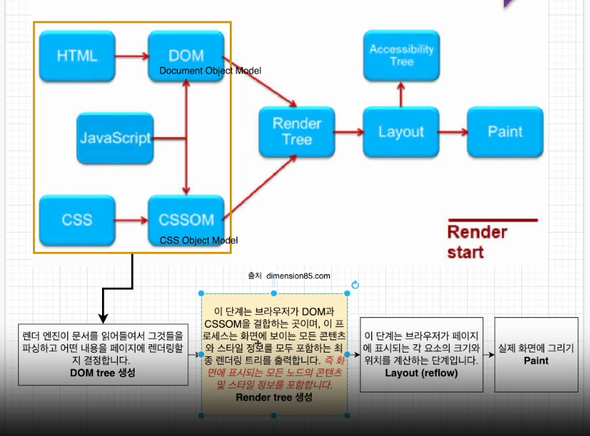

# Javascript

> 구름톤 강의를 들으면서 정리한 내용

### 🔹 템플릿 리터럴

backtick(`)을 사용해서 문자열을 표현한 것을 템플릿 리터럴이라고 한다.

백틱 내에서 작성하면 줄바꿈을 쉽게 할 수 있고, 문자열 내부에 표현식을 포함할 수 있게 된다.

```js
// ES6
console.log(`string text line1
string text line2`);

const a = 5;
const b = 10;

//ES5
console.log("fifteen is" + (a + b) + " and\nnot " + (2 * a + b) + ".");
// "fifteen is 15 and
// not 20."

// ES6
console.log(`fifteen is ${a + b} and
not ${2 * a + b}.`);
// "fifteen is 15 and
// not 20."
```

---

### 🔹 for/in

for문에서 객체의 속성을 따라 반복하려면 `in`을 사용할 수 있다.

```js
const user = {
  name: "han",
  province: "경기도",
  city: "성남시",
};

for (let x in user) {
  console.log(x);
}
```

### 🔹 배열 loop 이용

```js
const locations = ["서울", "부산", "경기도", "대구"];

for (let i = 0; i < locations.length; i++) {
  console.log(locations[i]);
}

// forEach
locations.forEach(function (location, i, arr) {
  console.log(`${i} : ${location}`);
  console.log(arr);
});

// map
locations.map(function (location) {
  console.log(location);
});
```

- forEach<br>
  for 루프는 원래 사용되었던 접근방식이지만 **forEach는 배열 요소를 반복**하는 새로운 접근방식이다.

  forEach는 `break`를 사용할 수 없고, `await`와 완벽하게 작동하지 않는다.

  ❗ forEach문보다 for문이 성능이 더 빠르다.

- map<br>

---

### 🔹 Window 객체

자바스크립트를 사용하면 윈도우 객체를 사용할 수 있다.

윈도우 객체는 브라우저에 의해 자동으로 생성되며 웹브라우저의 창을 나타낸다. 즉 윈도우 객체는 자바스크립트의 객체가 아닌 브라우저의 객체이다.

var 키워드로 변수를 선언하면 윈도우 프로퍼티로 생성된다.

---

### 🔹 DOM

돔(문서 객체 모델)은 메모리에 웹페이지 문서 구조를 트리구조로 표현해서 웹 브라우저가 html 페이지를 인식하게 해준다.

웹페이지 요소들을 자바스크립트가 이용할 수 있게 **브라우저가 트리구조로 만든 객체 모델**을 의미한다.

❗ 돔에서는 각 html 요소(element)들을 `노드(node)`라고 부른다.

돔에서 api를 제공하는데, 이 api를 가지고 node에 접근하고 업데이트한다. 즉 돔 트리는 api를 이용해서 조작할 수 있다.

🔎 `document.querySelector`은 자바스크립트 부분이 아닌 브라우저에서 제공하는 윈도우 객체의 한 부분이다.

- CRP(웹페이지 빌드 과정)<br>
  브라우저가 서버에서 html 응답을 받고 화면에 표시하기 전 과정을 말한다. 웹 브라우저가 html 문서를 읽고, 스타일을 입히고 뷰포트에 표시하는 과정이다.



렌더 트리를 만들어서 출력하는 과정까지 성능을 많이 잡아먹기 때문에 이를 최소화 하기 위해서 리액트의 경우 가상돔을 만들어서 사용한다.

---

### 🔹 Document 객체

브라우저 내부에 콘텐츠의 객체이다.

```js
let val;
let list = document.querySelectorAll(.list);

val = list.childNodes; // nodeList 반환
```

---

### 🔹Dom navigate(돔 탐색)

- node type<br>
  1 - 요소(element)<br>
  2 - 속성(attribute)<br>
  3 - text node<br>
  8 - 주석(comment)<br>
  10 - doctype

- children element nodes 반환

```js
val = list.children; // HTML Collection 반환 (line break X)
```

childNodes와 달리 children을 사용하면 실제 요소들만 반환된다.

❗ firstChild는 childNodes[0]과 동일하다.

```js
val = list.childElementCount; // child 요소 count
```

```js
val = listItem.nextElementSibling;
```

---

### 🔹 DOM 컬렉션

childNodes는 배열처럼 보이지만 반복가능(iterable)한 유사 배열 객체인 컬렉션이다.

이는 배열이 아니기 때문에 배열 메서드를 사용할 수 없다. 배열 메소드를 사용하고 싶으면 `Array.from()`을 사용해서 배열로 만들어 사용할 수 있다.

💡 Array.from(array명): 배열과 유사한 형식의 객체를 배열의 형식으로 변환해줌<br>
-> 프로그래머스 코테연습 하면서 다른 사람 코드를 보고 참고해놓은 사항이라 기억이 났다!

컬렉션에서는 for...of를 사용 가능하다. for...of는 배열을 순환할 때 사용한다.

```js
for (let node of list.childNodes) {
  console.log(node); // list 컬렉션 내 요소들이 출력된다.
}
```

❗ for...in은 사용 불가능

또한 배열은 아니지만 forEach문도 사용 가능하다.

---

### 🔹 요소 생성(create element)

- CreateElement<br>

  ```js
  document.createElement(tagName);
  ```

  createElement 메서드에 태그명을 넣어서 요소를 생성한다.

  ```js
  const link = document.createElement("a"); // element 생성 -> a 태그
  link.className = "alarm-item"; // a 태그 클래스 생성
  link.innerHTML = '<i class = "bi-alarm"></i>'; // a 태그(.alarm-item) 블록 내 i 태그(.bi-alarm) 생성

  li.appendCHild(link); // li 요소에 link 자식요소로 추가

  document.querySelector("ul.list-group").appendChild(li);
  ```

- 클래스 추가하기<br>

  ```js
  li.className = "list-group-item";
  ```

- id 추가하기<br>

  ```js
  li.id = "new-item";
  ```

- setAttribute<br>

  ```js
  li.setAttribute("name", "New list item");
  ```

  지정된 요소의 속성값을 설정한다. 속성이 이미 있다면 값은 업데이트되고 없다면 새로운 속성이 추가된다.<br>

  - getAttribute(name, value): 속성의 현재값 추출
  - removeAttribute(name, value): 속성 제거

---

### 🔹 요소 교체(replace element)

```js
const oldElement = document.getElementById("A");
const newElement = document.createElement("span");

newElement.textContent = "hi";

oldElement.parentNode.repalceChild(newElement, oldElement);
```

---

### 🔹 이벤트

- Event Listener

  1. 자바스크립트 코드에서 프로퍼티로 등록

  ```js
  // 문서가 로드될 때 이 함수 실행
  window.onload = function = () => {
    let text = document.getElementById('text'); // id가 text인 요소 반환
    text.innerText = "html 문서 load";
  }
  ```

  2. html 태그에서 속성으로 등록

  ```html
  <button onclick="alert('버튼이 클릭됐습니다.')">버튼</button>
  ```

  3. **addEventListener 메소드 사용**

  ```js
  element.addEventListener(이벤트명, 실행할 함수, 옵션);
  ```

  실행할 함수가 이벤트 리스너이다.

  ```js
  const aElement = document.querySelector("a");
  aElement.addEventListener("click", () => {
    alert("a element clicked");
  });
  ```

- 이벤트 종류

  | 분류          | 이름           | 설명                                                            |
  | ------------- | -------------- | --------------------------------------------------------------- |
  | UI 이벤트     | load           | 문서나 객체가 로드 완료되었을 때 발생                           |
  |               | change         | 객체의 내용이 변동되거나 포커스를 잃었을 때 발생                |
  |               | resize         | 객체의 크기가 바뀌었을 때 발생                                  |
  |               | scroll         | 스크롤바를 조작할 때 발생                                       |
  |               | error          | 에러가 발생했을 때 발생                                         |
  | 키보드 이벤트 | **keydown**    | 키를 눌렀을 때 발생                                             |
  |               | keyup          | 키를 눌렀다가 뗐을 때 발생                                      |
  |               | keypress       | 사용자가 눌렀던 키의 문자가 입력되었을 때 발생                  |
  | 마우스 이벤트 | **click**      | 객체를 클릭했을 때 발생                                         |
  |               | dblclick       | 객체를 더블클릭했을 때 발생                                     |
  |               | **mousedown**  | 마우스를 클릭했을 때 발생                                       |
  |               | mouseout       | 마우스가 특정 객체 밖으로 나갔을 때 발생                        |
  |               | mouseover      | 마우스가 특정 객체 위로 올려졌을 때 발생                        |
  |               | mousemove      | 마우스가 움직였을 때 발생                                       |
  |               | **mouseup**    | 마우스에서 손을 뗐을 때 발생                                    |
  | 포커스 이벤트 | focus          | 객체가 포커스 되었을 때 발생                                    |
  |               | blur           | 객체가 포커스를 잃었을 때 발생                                  |
  | 폼 이벤트     | input          | input, textarea 요소 값이 변경되었을 때 발생                    |
  |               | change         | 선택 상자, 체크박스, 라디오 버튼의 상태가 변경되었을 때 발생    |
  |               | select         | 텍스트를 선택했을 때 발생                                       |
  |               | reset          | 리셋 버튼을 눌렀을 때 발생                                      |
  |               | submit         | 사용자가 버튼키 등을 활용하여 폼을 전송할 때 발생               |
  |               | cut/copy/paste | 사용자가 폼 필드의 콘텐츠를 잘라내기/복사/붙여넣기 했을 때 발생 |

- event.preventDefault()

  `<a>` 태그와 `<submit>` 태그는 해당 링크로 이동하거나 페이지를 새로고침하는 기능을 가지고 있다. 이때 페이지가 변하지 않도록 이벤트 전파를 막는 메서드로 `e.preventDfault()`가 있다.

  ```js
  function handleEvent(e) {
    if (e.type == "submit") {
      e.preventDefault();
    }
  }
  ```

- Event Bubbling(이벤트 버블링)

  중첩된 요소에 이벤트가 발생했을 때 가장 깊게 중첩된 요소의 이벤트가 위로 전달되는 것이다.

  ```js
  <form onclick="alert('form')">
    Form
    <div onclick="alert('div')">
      div
      <p onclick="alert('p')">p</p>
    </div>
  </form>
  ```

  중첩된 요소에 모두 이벤트 발생한다.

  p를 클릭했을 때 form, div, p 모두 이벤트가 발생하고 alert가 뜬다.

- Event Target

  ```js
  const form = document.querySelector("form");
  const div = document.querySelector("div");
  const p = document.querySelector("p");

  form.addEventListener("click", (e) => {
    e.target.style.backgroundColor = "yellow";

    setTimeout(() => {
      alert("target = " + e.target.tagName + ", this = " + this.tagName);
      e.target.style.backgroundColor = "";
    }, 0);
  });
  ```

  `event.target`은 **실제 이벤트가 시작된 '타겟' 요소**이다.

  `this(event.currentTarget)`은 **핸들러가 할당된 요소**이다.

- event.stopPropagation()

  버블링을 중단하기 위해서 `event.stopPropagation()`을 사용할 수 있다.

  ```js
  <form onclick="alert('form')">
    Form
    <div onclick="alert('div')">
      div
      <p onclick="e.stopPropagation()">p</p>
    </div>
  </form>
  ```

- 이벤트의 3단계 흐름

  1. 캡처링 단계: 이벤트가 윈도우에서부터 하위 요소로 전파

  2. 타깃 단계: 이벤트가 실제 타깃 요소에 전달

  3. 버블링 단계: 이벤트가 타깃에서 상위 요소로 전파

- Event Capturing(이벤트 캡처링)

  중첩된 요소에서 이벤트가 발생했을 때 상위 요소에서 시작해서 이벤트가 하위 요소로 전파되는 것이다.

  즉 이벤트 버블링과 반대 개념이라고 생각하면 되겠다.

  ```js
  for (let element of document.querySelectorAll("*")) {
    element.addEventListener(
      "click",
      (e) => {
        alert(`캡처링: ${element.tagName}`);
      },
      true
    );
    element.addEventListener("click", (e) => {
      alert(`버블링: ${element.tagName}`);
    });
  }
  ```

  위 코드를 통해 팝업창을 확인하면 html부터 타겟 요소까지 내려오는 것을 알 수 있다.
