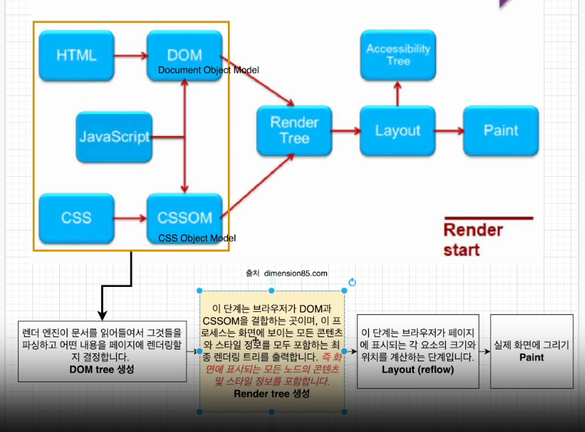

# Javascript

> 구름톤 강의를 들으면서 정리한 내용

### 🔹 템플릿 리터럴

backtick(`)을 사용해서 문자열을 표현한 것을 템플릿 리터럴이라고 한다.

백틱 내에서 작성하면 줄바꿈을 쉽게 할 수 있고, 문자열 내부에 표현식을 포함할 수 있게 된다.

```js
// ES6
console.log(`string text line1
string text line2`);

const a = 5;
const b = 10;

//ES5
console.log("fifteen is" + (a + b) + " and\nnot " + (2 * a + b) + ".");
// "fifteen is 15 and
// not 20."

// ES6
console.log(`fifteen is ${a + b} and
not ${2 * a + b}.`);
// "fifteen is 15 and
// not 20."
```

---

### 🔹 for/in

for문에서 객체의 속성을 따라 반복하려면 `in`을 사용할 수 있다.

```js
const user = {
  name: "han",
  province: "경기도",
  city: "성남시",
};

for (let x in user) {
  console.log(x);
}
```

### 🔹 배열 loop 이용

```js
const locations = ["서울", "부산", "경기도", "대구"];

for (let i = 0; i < locations.length; i++) {
  console.log(locations[i]);
}

// forEach
locations.forEach(function (location, i, arr) {
  console.log(`${i} : ${location}`);
  console.log(arr);
});

// map
locations.map(function (location) {
  console.log(location);
});
```

- forEach<br>
  for 루프는 원래 사용되었던 접근방식이지만 **forEach는 배열 요소를 반복**하는 새로운 접근방식이다.

  forEach는 `break`를 사용할 수 없고, `await`와 완벽하게 작동하지 않는다.

  ❗ forEach문보다 for문이 성능이 더 빠르다.

- map<br>

---

### 🔹 Window 객체

자바스크립트를 사용하면 윈도우 객체를 사용할 수 있다.

윈도우 객체는 브라우저에 의해 자동으로 생성되며 웹브라우저의 창을 나타낸다. 즉 윈도우 객체는 자바스크립트의 객체가 아닌 브라우저의 객체이다.

var 키워드로 변수를 선언하면 윈도우 프로퍼티로 생성된다.

---

### 🔹 DOM

돔(문서 객체 모델)은 메모리에 웹페이지 문서 구조를 트리구조로 표현해서 웹 브라우저가 html 페이지를 인식하게 해준다.

웹페이지 요소들을 자바스크립트가 이용할 수 있게 **브라우저가 트리구조로 만든 객체 모델**을 의미한다.

❗ 돔에서는 각 html 요소(element)들을 `노드(node)`라고 부른다.

돔에서 api를 제공하는데, 이 api를 가지고 node에 접근하고 업데이트한다. 즉 돔 트리는 api를 이용해서 조작할 수 있다.

🔎 `document.querySelector`은 자바스크립트 부분이 아닌 브라우저에서 제공하는 윈도우 객체의 한 부분이다.

- CRP(웹페이지 빌드 과정)<br>
  브라우저가 서버에서 html 응답을 받고 화면에 표시하기 전 과정을 말한다. 웹 브라우저가 html 문서를 읽고, 스타일을 입히고 뷰포트에 표시하는 과정이다.



렌더 트리를 만들어서 출력하는 과정까지 성능을 많이 잡아먹기 때문에 이를 최소화 하기 위해서 리액트의 경우 가상돔을 만들어서 사용한다.
