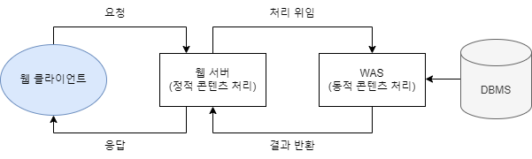
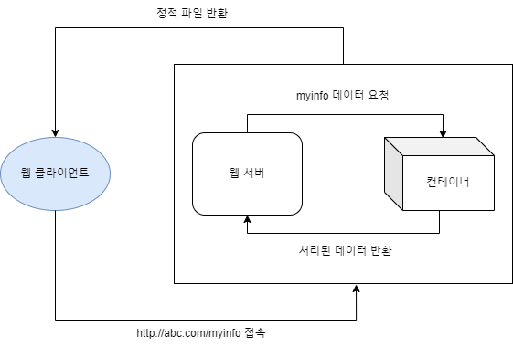
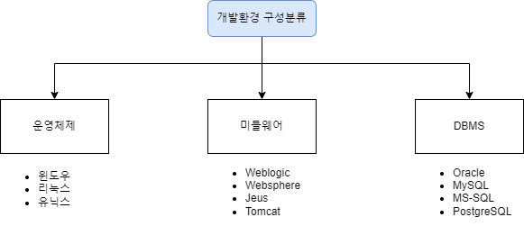

## 개발 도구

- 구현 도구: intelliJ, Eclipse, spring tool suite, netBeans, visual studio
- 테스트 도구: xUnit, pmd, findbugs, cppcheck, sonarQube
- 빌드 도구: maven, gradle, ant
- 형상관리 도구: git, cvs, subversion(SVN)

## 개발 환경 구성요소

- 하드웨어 개발환경

  - 서버 하드웨어 개발환경

    

    - 웹 서버: http, https를 통해 웹 브라우저에서 요청하는 html문서나 정적 콘텐츠를 처리하고 전송해주는 서비스 프로그램

      웹 상의 정적 콘텐츠(css, js, img 등)를 처리한다. web-was-db 3계층 구조를 실무에서 활용한다.

      주요 제품으로 Nginx, Apache 웹서버, IIS 웹서버, 구글 웹서버 등이 있다.

    - WAS: web application server의 약자로, 서버 계층에서 애플리케이션이 동작할 수 있는 환경을 제공하고 안정적인 트랜잭션 처리와 관리, 다른 이기종 시스템과의 애플리케이션 연동을 지원하는 서버이다.

      동적 콘텐츠(jsp, servlet)를 처리하기 위해 사용한다.

      주요 제품으로 톰캣, weblogic, jeus, resin 등이 존재한다.

      

    - DB 서버: 데이터의 수집, 저장을 위한 용도로 사용하는 서버

      연계되는 주요 dbms는 mysql, oracle, ms-sql, db2 등이 있다.

- 소프트웨어 개발환경

  프로젝트 요구사항에 부합하는 운영체제, 미들웨어, DBMS를 선정한다.

  

  - 미들웨어: 컴퓨터와 컴퓨터 간의 연결을 쉽고 안전하게 할 수 있도록 해주고 이에 대한 관리를 도와주는 소프트웨어

    자바 기반 환경에서 `JVM`을 설치하여 **컨테이너**로의 기능을 주로 사용한다.

    🔎 JVM: java virtual machine의 약자로, 시스템 메모리를 관리하면서 자바 기반 애플리케이션을 위해 이식 가능한 실행환경을 제공하는 소프트웨어이다.

    🔎 컨테이너: JSP와 서블릿을 실행시킬 수 있는 소프트웨어이다.
